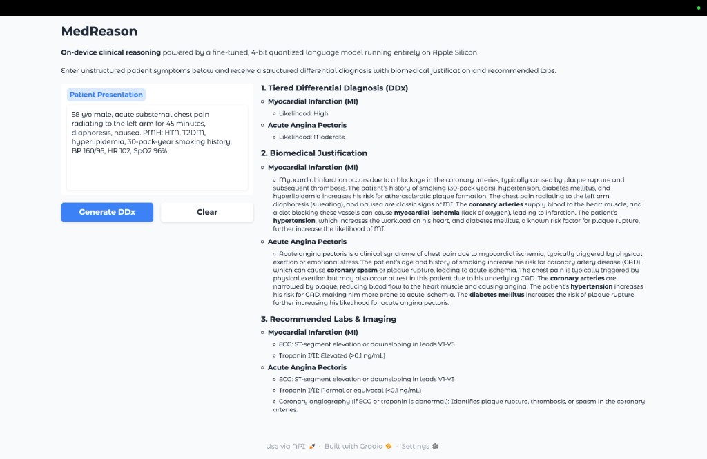

# MedReason

On-device clinical reasoning AI for Apple Silicon. Takes unstructured patient
symptoms and outputs a structured **Differential Diagnosis (DDx)**, biomedical
justification, and recommended lab tests — entirely offline, entirely private.

## Demo



## Results

MedReason produces **78% more differential diagnoses** than the base model
while maintaining perfect structured output:

```
                          │    BASE MODEL     │     MEDREASON
                          │ Sects Conds AvgJL │ Sects Conds  AvgJL
──────────────────────────┼───────────────────┼────────────────────
Acute Chest Pain          │   3     4  1256   │   3    18    310
Stroke Symptoms           │   3     7   809   │   3    11    227
Appendicitis              │   3     6   308   │   3    13    358
Diabetic Ketoacidosis     │   3     8   295   │   3    15    207
Pulmonary Embolism        │   3     9  1181   │   3    16    277
Meningitis                │   3    12   123   │   3     9    197
Ectopic Pregnancy         │   3     8   145   │   3     8    197
Acute Kidney Injury       │   3     8   234   │   3    14    230
Anaphylaxis               │   3    10  1253   │   3    18    244
Hypothyroidism            │   3     6  1259   │   3    17    433
──────────────────────────┼───────────────────┼────────────────────
AVERAGE                   │  3.0   7.8  686   │  3.0  13.9   268
```

**Sects** = sections found (out of 3) | **Conds** = unique diagnoses listed |
**AvgJL** = average justification length per condition (chars)

## Architecture

```
┌─────────────────────────────────────────────────────────────────────┐
│                        MedReason Pipeline                          │
├──────────────────┬──────────────────────┬───────────────────────────┤
│   1. DATA PREP   │    2. TRAINING       │    3. INFERENCE           │
│                  │                      │                           │
│  HuggingFace     │  Qwen2.5-3B (8-bit)  │  medreason-4bit (~1.8GB) │
│  2.2M samples    │        │             │        │                  │
│       │          │   QLoRA (800 iters)  │   System Prompt           │
│  Filter (DDx +   │        │             │   (3-section DDx)         │
│  clinical +      │   Fuse Adapters      │        │                  │
│  length)         │        │             │   MLX Stream Generate     │
│       │          │   4-bit Quantize     │        │                  │
│  416K samples    │        │             │   Gradio UI               │
│  train/valid     │───────>│─────────────│──>localhost:7860           │
│  .jsonl          │                      │                           │
└──────────────────┴──────────────────────┴───────────────────────────┘
```

| Component | Detail |
|-----------|--------|
| **Hardware** | Apple Silicon (M4) with 16 GB unified memory |
| **Base model** | [Qwen2.5-3B-Instruct](https://huggingface.co/mlx-community/Qwen2.5-3B-Instruct-8bit) (8-bit MLX) |
| **Training data** | [II-Medical-Reasoning-SFT](https://huggingface.co/datasets/Intelligent-Internet/II-Medical-Reasoning-SFT) (416K filtered samples) |
| **Fine-tuning** | QLoRA via [mlx-lm](https://github.com/ml-explore/mlx-lm) — 800 iters, cosine LR decay |
| **Inference** | 4-bit quantized, streaming generation |
| **UI** | [Gradio](https://gradio.app) local web interface |

## Quick Start

```bash
# 1. Clone and set up
git clone https://github.com/yaswanth0207/MedReason.git
cd MedReason
python3 -m venv .venv && source .venv/bin/activate
pip install -r requirements.txt

# 2. Authenticate with Hugging Face (faster downloads)
hf auth login

# 3. Prepare training data (~10 min download + filtering)
python prepare_data.py

# 4. Fine-tune, fuse, and quantize (~60-90 min on M4)
bash train_and_fuse.sh

# 5. Launch the UI
python app.py
# Opens at http://localhost:7860

# 6. (Optional) Run evaluation
python evaluate.py
```

## Project Structure

```
MedReason/
├── prepare_data.py      # Download, filter & format reasoning dataset
├── lora_config.yaml     # QLoRA hyperparameters
├── train_and_fuse.sh    # Train → fuse → quantize pipeline
├── app.py               # Gradio streaming UI
├── evaluate.py          # Base model vs MedReason comparison
├── EVALUATION.md        # Evaluation methodology
├── requirements.txt     # Pinned dependencies
├── .gitignore
└── README.md
```

## Pipeline

### 1. Data Preparation (`prepare_data.py`)

Downloads [Intelligent-Internet/II-Medical-Reasoning-SFT](https://huggingface.co/datasets/Intelligent-Internet/II-Medical-Reasoning-SFT)
(2.2M medical reasoning samples), then applies three filters:

- **Length filter**: 200–3000 characters (removes trivial and OOM-causing samples)
- **Clinical keywords**: must contain terms like `diagnosis`, `treatment`, `symptoms`
- **DDx keywords**: must contain reasoning language like `differential`, `rule out`, `consider`, `pathophysiology`

This produces **416K high-quality samples** formatted into the `chat` schema
(JSON with a `messages` array), split 90/10 into training and validation sets.

### 2. Training & Export (`train_and_fuse.sh`)

1. **QLoRA fine-tune** — 800 iterations on the 8-bit base model with rank-8
   LoRA adapters targeting Q/K/V/O projections. Uses cosine LR decay with
   50-step warmup to prevent training collapse.
2. **Fuse & dequantize** — merges adapters into the base model at FP16
   precision to avoid quantization noise.
3. **4-bit quantize** — compresses to ~1.8 GB for fast inference.

### 3. Inference UI (`app.py`)

Loads the quantized model and serves a Gradio interface. A strict system
prompt constrains output to three sections: Tiered DDx, Biomedical
Justification, and Recommended Labs. Text streams in real time.

### 4. Evaluation (`evaluate.py`)

Runs 10 clinical test cases through both the base model and MedReason,
scoring on section completeness, condition count, and justification depth.
See [EVALUATION.md](EVALUATION.md) for methodology.

## Training Journey

This project went through three training iterations — each failure informed
the next attempt:

### Run 1: General medical Q&A (lavita/medical-qa-datasets)

Fine-tuned on 215K unfiltered medical Q&A pairs for 600 iterations. The model
**degraded** — scoring 1.4/3 sections vs the base model's 3.0/3. Root cause:
training data was short forum-style answers ("take ibuprofen and rest"), not
DDx-formatted reasoning. The model learned to abandon structured output.

### Run 2: Filtered Q&A with aggressive training

Applied a clinical quality filter (200+ chars, clinical keywords), reducing
to 83K samples. Trained for 2000 iterations with LR 1e-5. **Loss went to
`nan` at iteration ~1610** — the model collapsed numerically. All checkpoints
after that point produced garbage output. Root cause: learning rate too high
for extended training, no warmup, no decay schedule.

### Run 3: Purpose-built reasoning dataset (current)

Pivoted to `Intelligent-Internet/II-Medical-Reasoning-SFT` — a dataset
specifically designed for medical reasoning. Added DDx keyword filtering,
dropped LR to 3e-6 with cosine decay and warmup, added dropout
regularization. Result: **3.0/3 sections, 13.9 conditions** (vs base
model's 7.8). First run where fine-tuning actually improved on the base model.

## Configuration

All training hyperparameters live in `lora_config.yaml`:

| Parameter | Value | Notes |
|-----------|-------|-------|
| `model` | `mlx-community/Qwen2.5-3B-Instruct-8bit` | Pre-converted MLX model |
| `iters` | 800 | Training iterations |
| `batch_size` | 2 | Fits in 16 GB unified memory |
| `learning_rate` | 3e-6 | Conservative to prevent collapse |
| `lr_schedule` | cosine_decay | Smooth decay with 50-step warmup |
| `lora rank` | 8 | Adapter rank |
| `mask_prompt` | true | Loss only on assistant tokens |
| `max_seq_length` | 1024 | Capped to prevent OOM |
| `dropout` | 0.05 | LoRA dropout for regularization |
| `grad_checkpoint` | true | Reduces peak memory usage |

## Requirements

- macOS on Apple Silicon (M1/M2/M3/M4)
- Python 3.11+
- ~10 GB free disk space (dataset download + model artifacts)

## Disclaimer

MedReason is a research prototype. It is **not** a certified medical device
and must **not** be used for real clinical decision-making. Always defer to
qualified healthcare professionals.

## License

MIT
